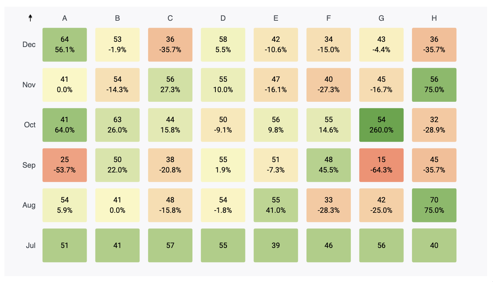

# Grafana Heatmap Panel

Heatmap visualization for display color encoded magnitudes in a data matrix.

Heatmap                | Heatmap colored By change in row level Per column
:---------------------:|:-------------------------------------------------:
   |  

## Installing

Using the grafana-cli:

```bash
grafana-cli --pluginUrl https://github.com/IsmaelMasharo/heatmap-matrix-panel/raw/master/heatmap-matrix-panel.zip plugins install heatmap-matrix-panel
```

## Grafana Version

Tested on Grafana 7.3.1

## Required Fields

The diagram gets constructed from a data source **formatted as table** with 1 mandatory field: **idx**, which represents the row-level labels of the heatmap. Every other field will be mapped as a column in the diagram and their data type should be set as **numeric**.

The diagram at the beginning was created with the following table format:

| idx | A  | B  | C  | D  | E  | F  | G  | H  |
|-----|----|----|----|----|----|----|----|----|
| Dec | 64 | 53 | 36 | 58 | 42 | 34 | 43 | 36 |
| Nov | 41 | 54 | 56 | 55 | 47 | 40 | 45 | 56 |
| Oct | 41 | 63 | 44 | 50 | 56 | 55 | 54 | 32 |
| Sep | 25 | 50 | 38 | 55 | 51 | 48 | 15 | 45 |
| Aug | 54 | 41 | 48 | 54 | 55 | 33 | 42 | 70 |
| Jul | 51 | 41 | 57 | 55 | 39 | 46 | 56 | 40 |

## Display Options

### Cell Color
* Heatmap (Default): Color encoding is set using a continuous color scale created using the complete dataset.

* By change in row level Per column:  
    Columns in the data matrix are considered categories, within each category the color encoding is set using the **percentage change** from one row-record to the next one. 

    An increase in magnitude compared to the previous value is encoded as a *green scale*; a decrease, as a *red scale*. No change is encoded as *light yellow*.

    The percentage change is displayed below the totals on each cell.

### Change Direction

Available when the *Cell Color* option is *By change in row level Per column*.

* Bottom to Top (↟) (Default): Percentage change is calculated using the bottom value relative to each cell. Bottom most values are encoded as green with no percentage change label since there's no bottom value at this level.
* Top to bottom (↡): Percentage change is calculated using the top value relative to each cell. Topmost values are encoded as green with no percentage change label since there's no top value at this level.

In both cases, a symbol indicator is visible at the top-left side of the panel indicating the change direction type.

### Toggle Color on Click

Boolean. If true toggles color between the two coloring options. Default false.